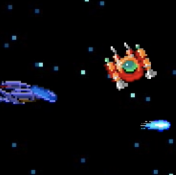
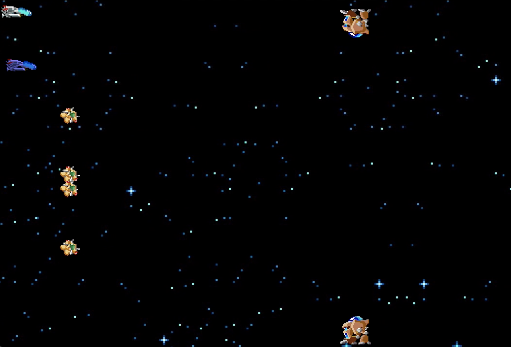
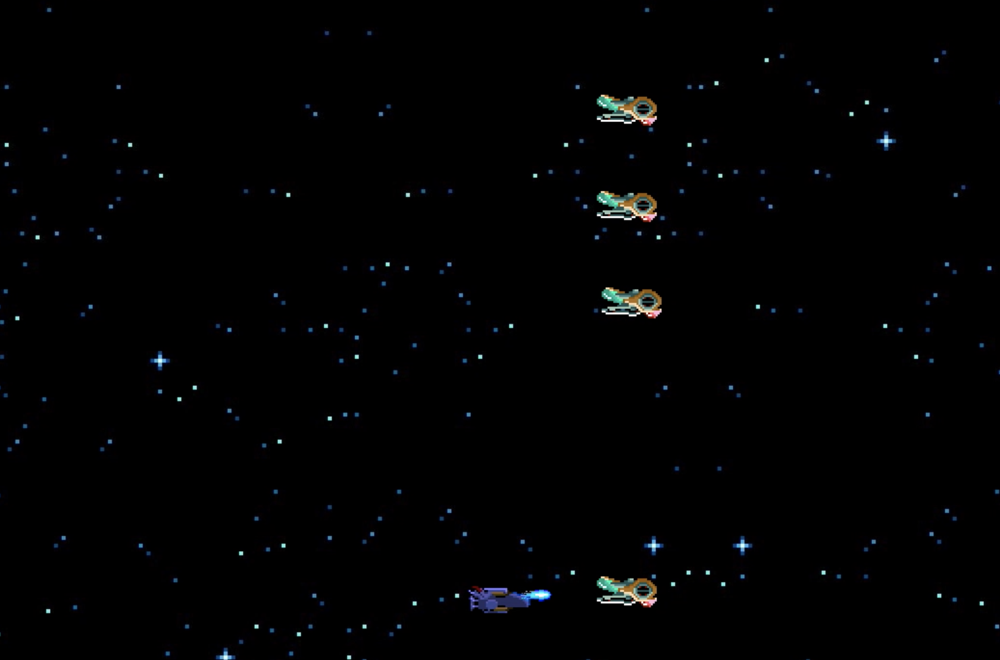
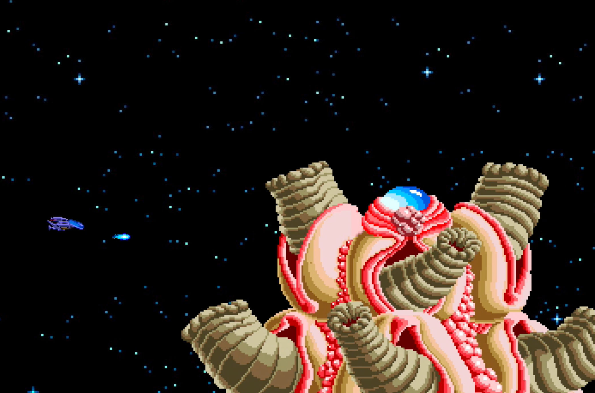

<!-- PROJECT LOGO -->
<br />
<p align="center">
  <a href="https://github.com/nicklamyeeman/R-TYPE">
    
  </a>

  <h3 align="center">R-TYPE</h3>

  <p align="center">
    A multiplayer game of the same-named original game 
    <br />
    <a href="https://github.com/nicklamyeeman/R-TYPE"><strong>Explore the docs »</strong></a>
    <br />
    <br />
    <a href="https://github.com/nicklamyeeman/R-TYPE/issues">Report Bug</a>
    ·
    <a href="https://github.com/nicklamyeeman/R-TYPE/issues">Request Feature</a>
  </p>
</p>


<!-- TABLE OF CONTENTS -->
## Table of Contents

* [About the Project](#about-the-project)
  * [Built With](#built-with)
* [Getting Started](#getting-started)
  * [Prerequisites](#prerequisites)
  * [Installation](#installation)
* [Usage](#usage)
* [Roadmap](#roadmap)
* [Contributing](#contributing)
* [Contact](#contact)
* [Acknowledgements](#acknowledgements)


<!-- ABOUT THE PROJECT -->
## About The Project

This game is a 3rd year project at Epitech school. The goal of the project is mainly to be able to answer a precise specification.
The game MUST be a multiplayer game and includes exactly 3 parts: 
1 server, 1 game engine and 1 client.
The project also included a package manager: Conan 


### Built With

* [SFML](https://www.sfml-dev.org/download/sfml/2.5.1/)
* [Conan](https://conan.io/center/)


<!-- GETTING STARTED -->
## Getting Started

To get a local copy up and running follow these simple steps.

### Prerequisites

Be sure you have Conan and SFML installed on your PC, then open a terminal

### Installation

1. Clone the repo
```sh
git clone https://github.com/nicklamyeeman/R-TYPE.git
```
2. Compile it
```sh
./compile.sh
cd build/
```


<!-- USAGE -->
## Usage

### Example

```sh
./r_type_server 3000
```

You have to start a server to host a game and be able to play with multiple clients

```sh
./r_type_client 127.0.0.1 3000
```

You have to join with an address and the opened port.

<br/>

Once you launch one server and one client, you will get a black SFML window.
Use your <kbd>T</kbd> key to create a game 
(You won't see anything, that's normal)





You can now join with another clients. Here are useful keyboards commands and their actions on server side (with RFC code) : 

<kbd>A</kbd> code : 521 = list all servers while in menu

<kbd>Z</kbd> code : 531 = list all servers while in game lobby

<kbd>E</kbd> code : 532 = back to main menu

<kbd>R</kbd> code : 522 = quit server

<kbd>T</kbd> code : 520 = create game lobby

<kbd>J</kbd> : 5300 (530 + 0) = join game lobby n°1

<kbd>Enter</kbd> : 600 = start game

<kbd>Q</kbd> code : 622 if in game = back to game lobby or 602 if not = back to main menu



<kbd>F</kbd> code : 625 = FIRE

<kbd>↑</kbd> code : 626 = move up

<kbd>←</kbd> code : 628 = move left

<kbd>↓</kbd> code : 627 = move down

<kbd>→</kbd> code : 629 = move right
</br>


Now that you have all keys in hand (lmao) you can play the game with your friends !


The game also includes bosses



### BE CAREFUL

1 - Please read carefully how to use conan properly !

2 - Be sure you are in the build/ directory before playing with the client

3 - Do not play this game lol, this is a technical project with many problems, please go find another project easier to play. This one is an archive of how hard that was to work with conan / cmake and sfml encapsulation in c++ client side and server side.

<!-- ROADMAP -->
## Roadmap

See the [open issues](https://github.com/nicklamyeeman/R-TYPE/issues) for a list of proposed features (and known issues).


<!-- CONTRIBUTING -->
## Contributing

Contributions are what make the open source community such an amazing place to be learn, inspire, and create. Any contributions you make are **greatly appreciated**.

1. Fork the Project
2. Create your Feature Branch (`git checkout -b feature/AmazingFeature`)
3. Commit your Changes (`git commit -m 'Add some AmazingFeature'`)
4. Push to the Branch (`git push origin feature/AmazingFeature`)
5. Open a Pull Request

We were 4 originally on this project : 
 - LAM YEE MAN Nick
 - DEMEESTER Alexandre
 - MALARDE Arthur
 - DESPAGNE Eddy


<!-- CONTACT -->
## Contact

Nick LAM YEE MAN - [@nickauteen](https://twitter.com/nickauteen) - nick.lam-yee-man@epitech.eu

Project Link: [https://github.com/nicklamyeeman/R-TYPE](https://github.com/nicklamyeeman/R-TYPE)


<!-- ACKNOWLEDGEMENTS -->
## Acknowledgements

* [Best-README Template](https://github.com/othneildrew/Best-README-Template)


<!-- MARKDOWN LINKS & IMAGES -->
<!-- https://www.markdownguide.org/basic-syntax/#reference-style-links -->
[contributors-shield]: https://img.shields.io/github/contributors/nicklamyeeman/repo.svg?style=flat-square
[contributors-url]: https://github.com/nicklamyeeman/repo/graphs/contributors
[forks-shield]: https://img.shields.io/github/forks/nicklamyeeman/repo.svg?style=flat-square
[forks-url]: https://github.com/nicklamyeeman/repo/network/members
[stars-shield]: https://img.shields.io/github/stars/nicklamyeeman/repo.svg?style=flat-square
[stars-url]: https://github.com/nicklamyeeman/repo/stargazers
[issues-shield]: https://img.shields.io/github/issues/nicklamyeeman/repo.svg?style=flat-square
[issues-url]: https://github.com/nicklamyeeman/repo/issues
[license-shield]: https://img.shields.io/github/license/nicklamyeeman/repo.svg?style=flat-square
[license-url]: https://github.com/nicklamyeeman/repo/blob/master/LICENSE.txt
[linkedin-shield]: https://img.shields.io/badge/-LinkedIn-black.svg?style=flat-square&logo=linkedin&colorB=555
[linkedin-url]: https://linkedin.com/in/nicklamyeeman
[product-screenshot]: images/screenshot.png